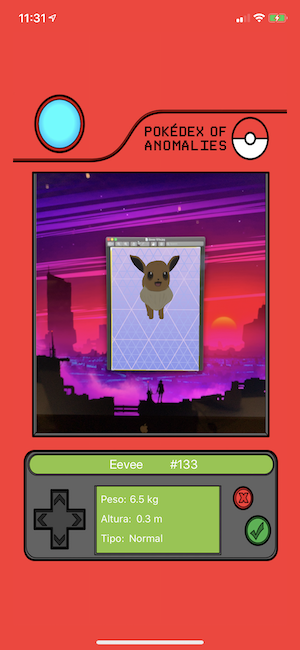
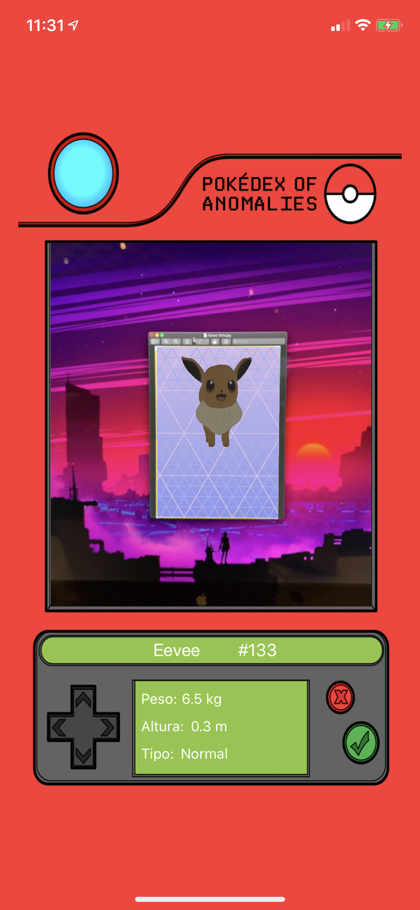

# Entrega ARKit: Pokédex AR

Como o image tracking foi algo que me chamou muita atenção na apresentação do ARKit, para essa entrega, decidi fazer uma pokédex utilizando isso.

## O App

O aplicativo funciona a partir do tracking de cartas do pokemon. As cartas adicionadas foram: Eevee, Lapras, Charizard e Pikachu. Assim, quando a camera é apontada para uma dessas cartas o respectivo pokemon aparece em realidade aumentada, sendo possível vê-lo em diferentes angulos quando mover o celular gentilmente para os lados. Além disso, ainda é possível ouvir informações sobre o pokemon.

# Cartas para visualização do pokemon

# Créditos

## Modelos 3D utilizados

[Eevee - Por Katerina Novakova][00]

[Lapras - Por Katerina Navakova][01]

[Pikachu - Por Frédéric Cambon][02]

[Charizard - Por animalSS][03]

## Sons utilizados

[Pokédex Interativa - Em Português - KANTO (#1-151)][04]

## Dados utilizados para alimentar a pokédex

[Pokemon.com][05]

## Cartas

[Pokemoncards.com.au][06]

[00]:https://sketchfab.com/3d-models/pokemon-eevee-ca723f9d4e08409ea433032d94cead17/
[01]:https://sketchfab.com/3d-models/pokemon-lapras-3d7364edd4e2406d87850524dcd5499b/
[02]:https://sketchfab.com/3d-models/025-pikachu-e69fbccccf1449acb0d9328ac9bea79d/
[03]:https://sketchfab.com/3d-models/charizard-27e58e7e6cdc430b8745aad24268f5e5/
[04]:https://youtu.be/JCyUKOwp-ww/
[05]:https://www.pokemon.com/us/pokedex/
[06]:https://pokemoncards.com.au/full-shop/pokemon_singles/black-white-4-next-destinies-singles/lapras-25-99-rare/

